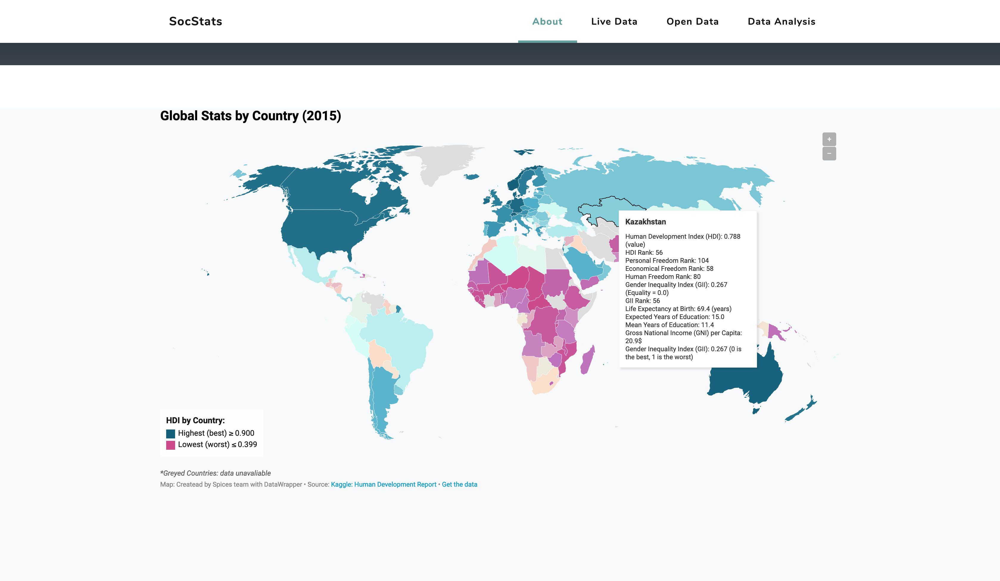
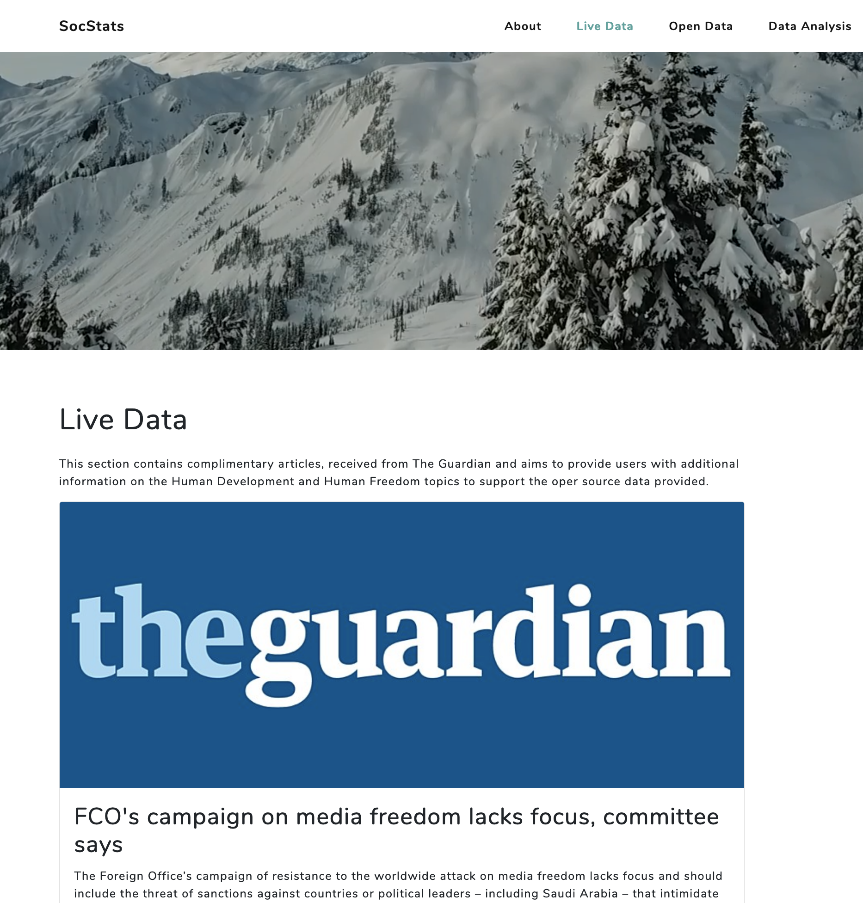
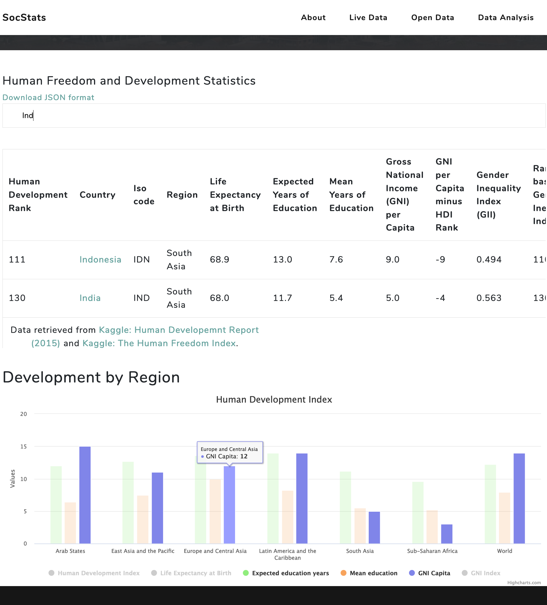

# SocStats Web App


## ABOUT THE PROJECT:

**The project is avaliable via the link: http://socstats-spices.herokuapp.com/**
*SocStats project was developed by Spices team as a part of MSc Information Technology course as a scope of a bigger project in order to demonstrate team skills, technology and its potential implementation. The idea was inspired by the datasets found in Kaggle: to gather global statistics and relevant data on sociology (like Human Development Index, Human Freedom Index, etc.) in one place, where it will be regularly updated from its sources and provide the users with free data visualization and analytical tools with options to download the selected results. The aim of the current project is to demonstrate a scope of such application as a demo prototype for the duture development. *

## The Context and DataSet Sources:

>**The Human Development Index (HDI)** is a summary measure of achievements in key dimensions of human development: a long and >healthy life, access to knowledge, and a decent standard of living. The HDI is the geometric mean of normalized indices for >each of the three dimensions. The health dimension is assessed by life expectancy at birth, the education dimension is >measured by mean of years of education for adults aged 25 years and more and expected years of education for children, and >the standard of living dimension is measured by gross national income per capita. The Inequality-Adjusted Human Development >Index (IHDI) adjusts the HDI for inequality in the distribution of each dimension across the population.

>**The Gender Development Index (GDI)** measures gender inequalities in achievement in three basic dimensions of human >development: health, measured by female and male life expectancy at birth; education, measured by female and male expected >years of education for children and female and male mean years of education for adults ages 25 and older; and command over >economic resources, measured by female and male estimated earned income. The Gender Inequality Index (GII) reflects gender- >based disadvantage in three dimensions—reproductive health, empowerment, and the labour market—for as many countries as data >of reasonable quality allow. It shows the loss in potential human development due to inequality between female and male >achievements in these dimensions. Source: https://www.kaggle.com/undp/human-development

>**The Multidimensional Poverty Index (MPI)** identifies multiple deprivations at the household level in education, health, >and standard of living as indicators of poverty. It uses micro data from household surveys, and — unlike the IHDI — all the >indicators needed to construct the measure must come from the same survey.

>**The Human Freedom Index** measures economic freedoms such as the freedom to trade or to use sound money, and it captures >the degree to which people are free to enjoy the major freedoms often referred to as civil liberties—freedom of speech, >religion, association, and assembly— in the countries in the survey. In addition, it includes indicators on rule of law, >crime and violence, freedom of movement, and legal discrimination against same-sex relationships. Source: https://www.kaggle.com/gsutters/the-human-freedom-index

Due to the huge size of the datasets all together and limitations of this project (time constraints, tasks constraints) we aimed to created the database to produce the scope of the dataset given as a demonstration of future potential of the application. Full datasets are available via the links above. 

## TARGET USERS:
The project was designed for researchers, students, analysts, human rights activists and any interested parties to ease the search and analysis processes, leaving people more time for action.

### Top-level User stories:
*	_A User should be able to access the web app from different devices via the link: https//fathomless-chamber 89094.herokuapp.com/_
*	_A User should be able to navigate easily through responsive menu and analytical tools._
*	_A User should be able to access open source and live data displayed on the website._
*	_A User should be able to download the data available._
*	_A User should be able to select data attributes and display the analysis results._

## Ruby version

```ruby 2.6.3p62 (2019-04-16 revision 67580) [x86_64-darwin18]```

```Rails 6.0.0```

**System dependencies:**

*file: package.json. Node dependencies:*


    "@amcharts/amcharts4": "^4.7.3",
    "@amcharts/amcharts4-geodata": "^4.1.7",
    "@fortawesome/fontawesome-free": "5.10.2",
    "@rails/actioncable": "^6.0.0-alpha",
    "@rails/activestorage": "^6.0.0-alpha",
    "@rails/ujs": "^6.0.0-alpha",
    "@rails/webpacker": "^4.0.7",
    "bootstrap": "^3.4.1",
    "highcharts": "^7.2.0",
    "jquery": "^3.4.1",
    "jquery.easing": "^1.4.1",
    "leaflet": "^1.5.1",
    "turbolinks": "^5.2.0"

*file: Gemfile. Node dependencies:*

Bundle edge Rails instead: gem 'rails', github: 'rails/rails'
```gem 'rails', '~> 6.0.0'```

Use Puma as the app server
```gem 'puma', '~> 3.11'```

Use SCSS for stylesheets
```gem 'sass-rails', '~> 5'```

Transpile app-like JavaScript. Read more: https://github.com/rails/webpacker
```gem 'webpacker', '~> 4.0'```

Turbolinks makes navigating your web application faster. Read more: https://github.com/turbolinks/turbolinks
```gem 'turbolinks', '~> 5'```

Build JSON APIs with ease. Read more: https://github.com/rails/jbuilder
```gem 'jbuilder', '~> 2.7'```

This gem provides jQuery and the jQuery-ujs driver for your Rails 4+ application.
```gem 'jquery-rails', '~> 4.3', '>= 4.3.5'```

Windows does not include zoneinfo files, so bundle the tzinfo-data gem
```gem 'tzinfo-data', platforms: [:mingw, :mswin, :x64_mingw, :jruby]```

A Sass-powered version of Bootstrap 3, ready to drop right into your Sass powered applications.
```gem 'bootstrap-sass'```

Gem that includes Highcharts (Interactive JavaScript charts for your web projects)
```gem 'highcharts-rails', '~> 6.0', '>= 6.0.3'```

Gem for consuming restful web services dead easy
```gem 'httparty', '~> 0.17.1'```

The CSV library provides a complete interface to CSV files and data. I
```gem 'csv', '~> 0.0.1'```

Reduces boot times through caching; required in config/boot.rb
```gem 'bootsnap', '>= 1.4.2', require: false```

**Gems that did NOT work out (error 500):**

Unirest is a set of lightweight HTTP libraries available in multiple languages.
```em 'unirest', '~> 1.1', '>= 1.1.2'```

A library for the Guardian Content API
```gem 'guardian-content'```


## Installation & Configuration


1. Clone, Fork or download the code package from the master branch https://github.com/AliceOwl/Socstats.git
2. Install Ruby, Rails and gems mentioned above. You might also need to install Bundle, NPM, Yarn and Nokogiri.
3. In the code directory run the folllowing commands:

```yarn install --check-files```

```bundle update```

**for database initialisation & configuration**

```rake db:migrate```

```rake developmentbyregion:seed_developmentbyregion```

```rake freedom:seed_freedom```

```rake development:seed_development```

**supporting gems for application:**

```gem install highcharts-rails ```

```npm install bootstrap@3```

```yarn add highcharts ```

```yarn add jquery ```

```gem install amcharts-js -v 0.1.0```

```sudo apt-get install libpq-dev or sudo apt-get install postgresql```

```yarn add jspdf```

## Deployment instructions

To run on the local/Development environment: ```rails server``` or ```rails s``` from the project directory

## Production Deployment: Heroku

_follow the instructions on the link below:_
https://devcenter.heroku.com/articles/getting-started-with-rails5

_in database.yml change production database adapter from sqlite3 to postgresql as mentioned in the file_

## Development Process:

The application was developed within two weeks, adapting spiral methodology to four 3-day iterations, as it suits best for a small project like this:

**Iteration 1:	Dataset search and application design**

Initially, two main datasets were chosen for the database: Human Development Report 2015 and the Human Freedom Index (see the links above), liked through 2 common attributes: countries  and year: 2015, so only the high-level categories are left for application optimization and better analysis. Rails is known for quick web development, but slow peformance. Taking into account Heroku limitation of 10000 records and tight project scedule, the team decided not to risk the production stage for the sake of a larger data scope, especially taking into account the complexity of linking the data (many variables for mismatching years had to be cut down).

**Iteration 2.	Database Design and Development**

3 Linked tables (=models) were created with Rails Active Records: _development_, _freedom_, _developmentbyregion_. SQLite3 was used for local DB development and Rails Active Record associations were used to link the models (tables) according to the database design principles (source: https://www.oreilly.com/library/view/access-database-design/0596002734/ch04.html)
DB scaffolding turned out to be challenging initially there were 123 columns which were later cut down to 30 (top-level categories). Linking two different dataset was a madatory task to minimise parent-child tables attributes/data conflicts while seeding the data from two datasets.

**Iteration 3.	Application Development**

The application was developed with Ruby on Rails, using Model-View-COntroller (MVC) architecture pattern.
GitHub was used for version control, using projects-automated kanban chart for tasks monitoring.
Bootstrap templates and themes were implemented for GUI (for optimization of development within the deadline). The Grayscale Bootstrap template was adapted for modification: #sass syntax@import for optimization of website performance by compiling the CSS into one file that is served to the browser. 
>CSS has an import option that lets you split your CSS into smaller, more maintainable portions. The only drawback is that >each time you use @import in CSS it creates another HTTP request. Sass builds on top of the current CSS @import but instead >of requiring an HTTP request, Sass will take the file that you want to import and combine it with the file you're importing >into so you can serve a single CSS file to the web browser. Source: https://sass-lang.com/guide
The template integration process caused a number of bugs that have been continiously fixed throughout the project.

DataWrapper, Amcharts and Highcharts were embedded for data visualization enhance the learning experience and build up on it in future development. 



Heroku for deployment of the application. Heroku required PostgreSQL as a database adapter for deployment, so it has been switching throughout the project.


**User Sotries by page**

* Home page: A User is able to access the main page, interactive global map, information about the app and contact details. 
* Open Data: A User is able to access the dataset, search by country, access detailed information by country and interactive  * Highcharts for general analysis of the data. 
* Data Analysis: A User is able to select countries (up to 5) to get data analysis (visualisation in graphs) for the countries selected - redirected to the results page. 
* Live Data: A User is able to access live data (articles) from the Guardian as a complimentary information sourse relevant to the research topic. 

Another controller/view was generated for analysis because it is connected to all the models.
To retrieve live data, used HTTParty gem to get the response from the guardian api. The response is parsed into json format to import the data based on the hash and key values. The team has also attempted to retrieve the data from http://hdr.undp.org/en using AJAX, JSON and API keys, but the process was stgnated in bugs, so The Guardian was chosen to retrieve the data from instead for the task completion, all other attepmts were commented/cut for further development.





**Iteration 3.	Debugging and Documentation**

The project task did not require testing, so only black box testing was implemented for quality assurance. The project has got through several debugging processed, as some of the gems and packages were causing conflicts, others were not responsive/not suitable for rails. A lot of them were related to JSON, gems, Bootstrap of Heroku. Some parts of the code were left unfinished and commented for future development. All sources are referenced in the code comments, including media files. 

SocStats was designed as a fat client application due to the advanced GUI interface, low server requirements, better multimedia performance: one of the goals was to make the data access and analysis easier for regular users, so responsiveness of the application and its high performance were prioritised. 


## Issues (partial implementation):

In this section the partially implemented features of the application are listed. These functionalities are currently under development stage, the team is working on its improvements. Pull requests and update suggestions will be much appreciated. 

* http://socstats-spices.herokuapp.com/  - for proper displaying the link has to be strictly http, NOT https: this project does not have ssl licence yet, so in the secure browsing regime some items will not display as expected
* The download of dataset is avaliable only in JSON format for now. 
* The detailed highcharts per country are availabe via country links in the table:


However, at the moment the highcharts display disappears on refresh and a user has to go back to reload it again.
* Used Helper methods to retrieve the data from the models, due to unsolvable issues, we migrated to ActiveRecord methods and queries 
* Download the entire data to json format. Click on download, redirects to page with json object and download option available only on reload the page. - future development
* Exception handling 
>(a special kind of object, an instance of the class Exception or a descendant of that class that represents some kind of >exceptional condition; it indicates that something has gone wrong. When this occurs, an exception is raised (or thrown).) 
was partially implemented

**Future potential:**

This project can be used as a starting point for further enhancement of its features, embedding more data, analytical tools and supporting documents as a user-friendly open-source project to ease the research and implement new unique analytical tools in future. Gradually the embedded parts can be replaced with original code with API for users provided. 


